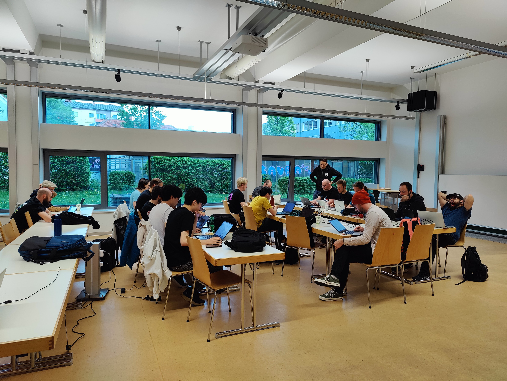

I attended my first Plasma sprint, and indeed my first in-person KDE event! It was an amazing experience! 😄

<!-- truncate -->

It was really great to be in the same room with so many talented and knowledgeable people. The amount of expertise gathered together was fantastic. The usual difficulties with remote communication were gone, and suddenly we could have easy back-and-forths, go sit next to someone to ask their expert opinion, and big group discussions could flow freely in a fraction of the time it would normally take.

Some of the cool things we talked about and worked on are: sandboxing (including things other than apps, like Plasma widgets and runners for KRunner), KNewStuff (where we can download new widgets/themes/etc), Activities, Telemetry, and oh so much more! We covered so much in such a short time it had my head spinning.

We also discussed the first-run experience (FRE) or out-of-the-box experience (OOBE) that is my current main focus. For those who are unfamiliar, this is the flow that happens when a user first turns on a new computer where it asks them to create the first user. Currently this doesn't exists for KDE (outside of some hacks that have significant drawbacks), and the user _has_ to be created during system installation. For technically inclined users doing their own system install this is no problem, but it is a big problem for other scenarios; think for example about…

- Government organizations or large businesses who want to image computers with the system software
- OEMs who need to pre-install an operating system
- Used computer shops saving those millions of PCs that can't run Windows 11

For all of these scenarios and more, the operating system needs to be installed but the user account should _not_ yet be created. Rather once the intended end-user has opened up the box and turned on their shiny new computer, only then should they be prompted to "Choose your username and password" (among other things).

It was great to be able to present the vision for this, and I got great feedback, questions, suggestions, etc. Working together we came up with a solid plan to proceed, and I've started the work of implementing all of these ideas!

On the personal front, the whole experience was pretty challenging for me. Right off the bat my pre-existing medical condition means that I don't have much energy to work with on a daily basis, and that I get sick worse/more easily than most people do.. and wow did I ever get hit with the whole shebang!

After being hired on as the new Plasma Software Engineer, I had just under 2 weeks notice to try and arrange to attend the sprint. This started with needing my passport; I already had an appointment to get it, but not until just _after_ the sprint (I was getting it originally for use to attend Akademy!). So I had to go down and spend the entire day at the passport offices, to ask for it to be issued expedited - which thankfully I got! Then was a whirlwind of things like...

- Research (do I need a visa? what can I/can't I bring? what _should_ I bring? Is there any potential issues bringing my meds? (yes), travel insurance, mobile service, etc)
- Booking travel & lodging, and trying to do so at a semi-reasonable price while booking last minute
- Buying supplies for travel (toothbrush, laptop bag, water bottle, travel umbrella, climate appropriate clothing (we just had snow/ice storms in Canada before I left, and it is still getting down near freezing at night!), etc, etc)

Though I will say it is pretty lucky I had been casually learning German for the fun of it the past couple years. I definitely need more speaking practice though!

I am very happy I managed to attend, but generally I would _not recommend_ trying to arrange one's first international travel with only several day's notice haha! 😂

Yeah, that's right.. first. I've rarely been away from my hometown before, and I've actually never left my native timezone previously! So travelling to the other side of the planet was a bit of a change, to say the least. The travel was more than I expected: ~2 hr bus ride to the airport, waiting for hours to get on the plane, ~10 hrs across the ocean, ~2 hr layover, ~1 hr additional to Graz, then ~1.5 hrs figuring out the train/tram from the airport to the venue (I had to ask for help figuring out how to get to the train station). 

With all of this, the jetlag, as well as working 9 to 10 hour days I was feeling incredibly exhausted to put it mildly. Then I thought I was having a massive attack of allergies (I did just come from the land of ice and snow to a place where everything is green and blooming after all…), alas sadly I did catch a cold or something quite nasty that I am still trying to shake off. 😷🤧🤒😴

I learned a whole lot about travelling, there are a bunch of things I would do differently, and I am confident that my next trip will go _much_ more smoothly as a result!

I am so glad that I got to attend, because we got some great work done and I met lovely, friendly people. It was a very nice atmosphere, and everyone was very kind and welcoming. It is really good to be able to put faces to the names of people I've been working with for years in some cases!

I am really looking forward to seeing everyone again at Akademy~ 🎉 Tschüss!
