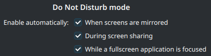

We're actually going to be using the `Do Not Disturb` feature in Plasma 6.4.

<!-- truncate -->

I say that because previously we had a hack that simply allowed notifications to
display over top of fullscreen windows, and do not disturb was only ever used
if:

- Screens are mirrored
- During screen sharing
- The user invoked it manually

This was a little odd, and led to some inconsistencies. Plus only Plasma knew
about the user's preference to see notifications in fullscreen, and despite
notifications being inhibited reading `org.freedesktop.Notifications.Inhibited`
would return false.

I changed this to
[actually use do not disturb when a fullscreen window is focused](https://invent.kde.org/plasma/plasma-workspace/-/merge_requests/4877). 
This is more predictable and in-line with what the user would expect, enhancing
the UX and communication with other parts of the system and apps.

As a result, we've discovered several bugs that had gone unnoticed! So far:

- [Notifications not being marked read](https://bugs.kde.org/show_bug.cgi?id=504350)
- [Showing a summary for unwanted notifications](https://invent.kde.org/plasma/plasma-workspace/-/merge_requests/5457)
- [Showing a summary every time the user leaves DND](https://invent.kde.org/plasma/plasma-workspace/-/merge_requests/5453)
- [Not showing critical notifications in DND when we should](https://invent.kde.org/plasma/plasma-workspace/-/merge_requests/5470)
- [Disabling app-specific notification history also prevents it from participating in DND summaries](https://bugs.kde.org/show_bug.cgi?id=504571)

My impression is that these bugs were not evident before because few people were
actually _using_ the do not disturb feature, thanks to the way we previously
handled notifications with fullscreen applications. Everyone has been hard at
work getting these fixed and hopefully DND will be more useful, predictable, and
reliable! 🎉 😄
