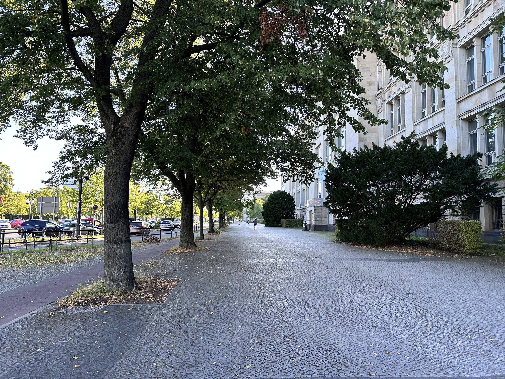
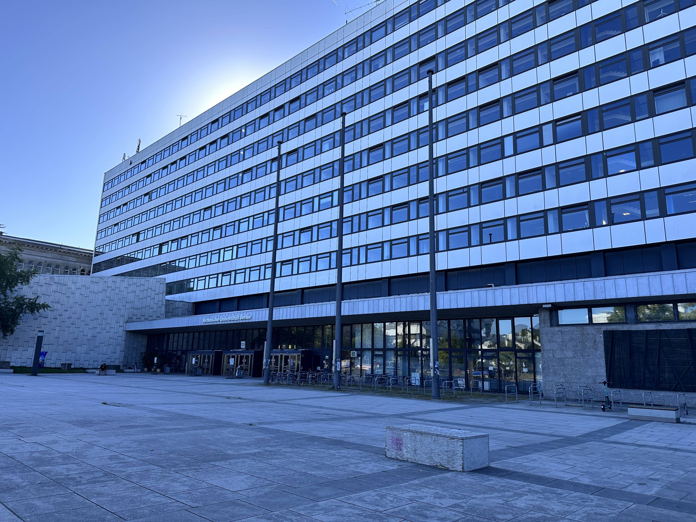
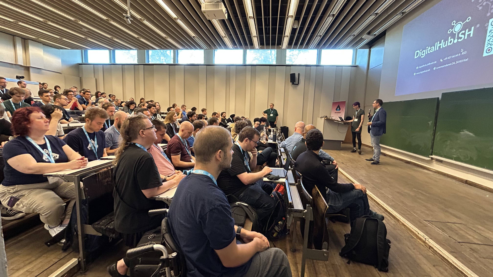
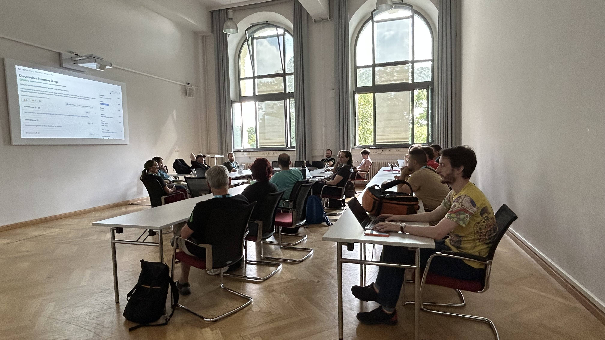
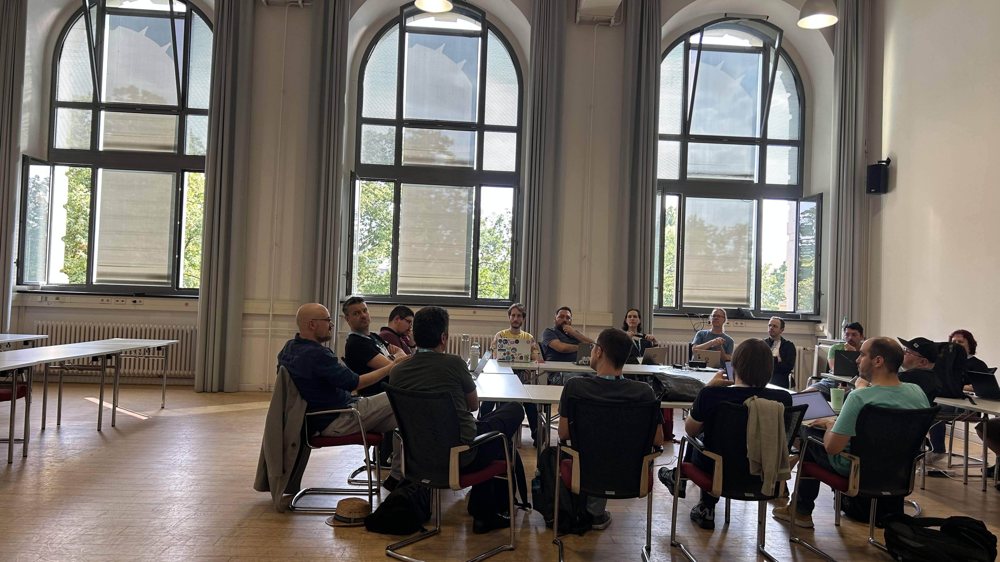
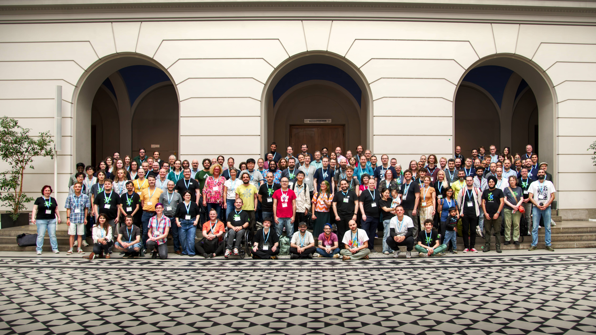

Akademy 2025 was hosted in Berlin, and this was my first time attending Akademy in person.

<!-- truncate -->

I was very excited both to see Berlin (and put my very shaky German skills to
practice), as well as to attend our big yearly event and meet some more cool
folks in person.

The trip out was fairly uneventful, if long (~17 hours of bus, planes, and
train). The biggest difference compared to travelling to the Plasma sprint is
that this time I had some good noise cancelling over-ear headphones -- what a
lifesaver! Especially when you end up on a flight across the ocean sandwiched
between 2 screaming, jumping, grabbing toddlers. 10/10 can recommend! The
headphones, not the toddlers. 😂

As expected when I arrived at my hotel I crashed and slept for 11 hours straight.

I had a good time at the welcome event. I offered to help and spent the evening
handing out food and drink tickets to everyone and chatting to a few people --
including an excellent conversation about the merits of QA & testing, which
still surprises me not everyone is on board with!

We had a huge amount of talks and BoFs to attend. (Sidenote: "BoF" stands for
"Birds of a Feather", and is apparently a more informal/less structured time for
talk/discussion/hacking/etc -- I was lost on what these letters meant for a long
time before now.)

I don't think I could hope to cover even a fraction of what went on, and indeed
because the schedule is structured in such a way that there are multiple things
going on at any given time, I had a lot of trouble choosing what to go to --
what if I want to attend them all?! Well, that is kind of what I am doing as I
am catching up on the recordings of what I missed after the fact.

I am very happy that the audio and video quality of the recordings appear to be
massively improved over last year's! Paired with the auto-generated captions on
YouTube it actually makes for an excellent way to consume the talks, and is
valuable even for the talks I attended in person since my auditory processing
disorder means that I have trouble understanding what people are saying
(massively worsened with low volume/echo/noisy environment/etc). If we can
figure out the infrastructure to also record the BoFs for next year that would
be another great step up for accessibility and allowing a wider audience to
participate & benefit. 💙

We had a BoF about the KDE Out-Of-Box-Experience (OOBE), where Neal Gompa and I
went through some of the history of the project (a lot, Neal has been
championing it forever!) and its current state (nearly ready for early testing
and adoption). There were some good questions, and I am consistently gratified
to see the interest and excitement there is for the project.

The schedule for Akademy was a _lot_ for me. On a normal day my available energy
is already quite limited, and the venue had a few challenges for me such as the
only restrooms and the elevator we were using being on the other side of the
building, which meant a whole lot of walking & standing to wait on hard floors
so I was feeling more fatigued and in pain than usual.

To top that off my anxiety was sky high, and I have no idea how much I was
masking but I think I may have ended up seeming like an unapproachable
wallflower.. I promise I am very friendly, just extremely anxious and awkward!
Despite that I ended up having a bunch of great conversations during the
conference with a bunch of people, and it was amazing to get together with so
many other Linux / FOSS / KDE nerds. 🤓

Around the end of Tuesday it was becoming apparent that I had caught a cold or
something from one of the many sneezes or coughs I had attempted to dodge during
this trip, and I missed out on the social activities on Wednesday and the last
day of activities of Thursday. I enjoyed watching the progress on Matrix anyway!
I am only now just starting to improve (I always struggle to fight off
infections like this).

Several people had said they wanted to talk to me at some point, and we didn't
get the chance before this cold knocked me out. *Wie Schade!* It isn't the same,
but feel free to reach out to me on Matrix! `@merritt:kde.org`

It was really awesome to get together in Berlin, to meet so many new great
people and to see familiar faces again, to work on so many interesting things
together. I wish I had more energy after a long day to do more social stuff,
because I loved getting the chance to interact with everyone in a more relaxed
and informal way. Maybe we can figure out some more relaxed / quiet / sensory
friendly social & food options next time for those of us who struggle with the
loud, crowded, and chaotic environments that are often the default for social
events.

Thanks Berlin for having us, even if the city *is* a bit noisy and has a
surprising number of smokers, it was very nice to visit! *Tschüss!!* 😀 💙

