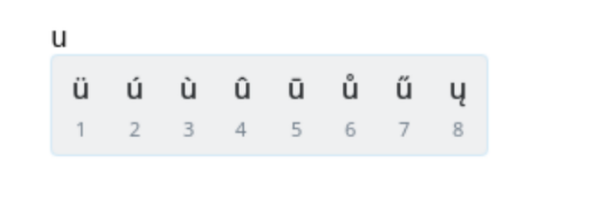
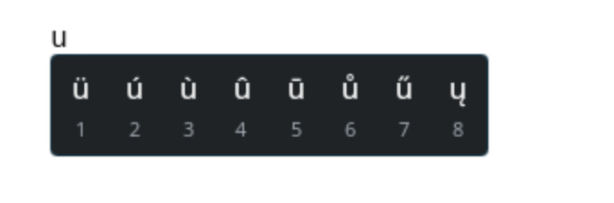

Plasma Keyboard has interesting news to share!

<!-- truncate -->

Plasma Keyboard started out life as KDE's virtual / on-screen keyboard, and now
it is evolving to also support tools and features for our physical keyboards.


## FLOSS/Fund

Plasma Keyboard was granted funding from the FLOSS/Fund program's second
tranche, for which we are very grateful! This funding has ensured we will be
able to put some sustained effort towards refining and improving the project —
and I have been doing just that for the past couple of months.

I began by getting more familiar with the codebase, lists of open bugs, and
feature requests. I also did some refactoring and cleanup, improved the CI and
MR review process, etc.


## Diacritics

https://invent.kde.org/plasma/plasma-keyboard/-/merge_requests/83

The first feature I tackled is the first one that is for physical keyboards
rather than virtual/on-screen keyboards: diacritics — the variants of a
character that indicate a difference in pronunciation, such as ç, ñ, or ü.
Though it is more than just diacritics, because it also supports common/popular
symbols, such as ™, — (em-dash), →, ¡, ‽, ¼, ≥, ≠, etc.





import diacriticsDemo from "./diacritics-demo.webm";

<video controls width="100%">
  <source src={diacriticsDemo} type="video/webm" />
</video>

If you'd like an idea of which diacritics and symbols are currently included,
you can check out the
[base mapping json](https://invent.kde.org/plasma/plasma-keyboard/-/blob/6896669297df5df2e8fe7e07b1c6000e2ee939c6/src/overlay/diacritics/base.json).
Further mappings are included depending on which language(s) you have enabled
for Plasma Keyboard in your system settings.

This feature allows users to long-press a key on their physical keyboard to
access a popup menu of diacritics and symbols related to that key, and select
one to input it. This is a common feature on mobile keyboards, and I personally
think this is a great improvement over using something like a compose key for
the same purpose.

Selecting an option from the popup menu can be done multiple ways:

- Pressing the associated keyboard number key shown below the option
- Clicking on the option with the mouse
- Using the arrow keys to navigate to the option and pressing `Enter`

This was pretty challenging to implement; I previously had no experience with
Wayland protocols or input methods, so it required a lot of research, reading,
learning, and experimentation to figure it out. Difficult, but rewarding!

One of the really cool things about Plasma Keyboard is that it is available as a
Flatpak — so if you are adventurous and want to try out the diacritics feature
before it is released to the stable version, you can do so with the nightly
Flatpak builds!

```bash
flatpak install --user --or-update https://cdn.kde.org/flatpak/plasma-keyboard-nightly/org.kde.plasma.keyboard.flatpakref
```

Then simply enable Plasma Keyboard in `System Settings` → `Keyboard` →
`Virtual Keyboard`! 🤯 If you already have a version of Plasma Keyboard
installed, a quick restart or log out/in might be needed for the new version to
take effect.


## Future Plans

In addition to the diacritics feature itself, I also laid the groundwork with it
for future features that will make use of the same overlay/popup system and
physical keyboard integration — stay tuned for more news on that! 😉

There are a bunch of other plans for features and improvements that we'd like to
work on, for example: swipe typing, voice typing, making the on-screen keyboard
movable and resizable, adding tests and improving performance and reliability,
etc.

There is a lot of work to be done, and we are excited to keep improving Plasma
Keyboard and making it even more powerful and user-friendly — just like the rest
of Plasma! 🚀

If you are interested in contributing, please check out the project on KDE's
GitLab: https://invent.kde.org/plasma/plasma-keyboard
