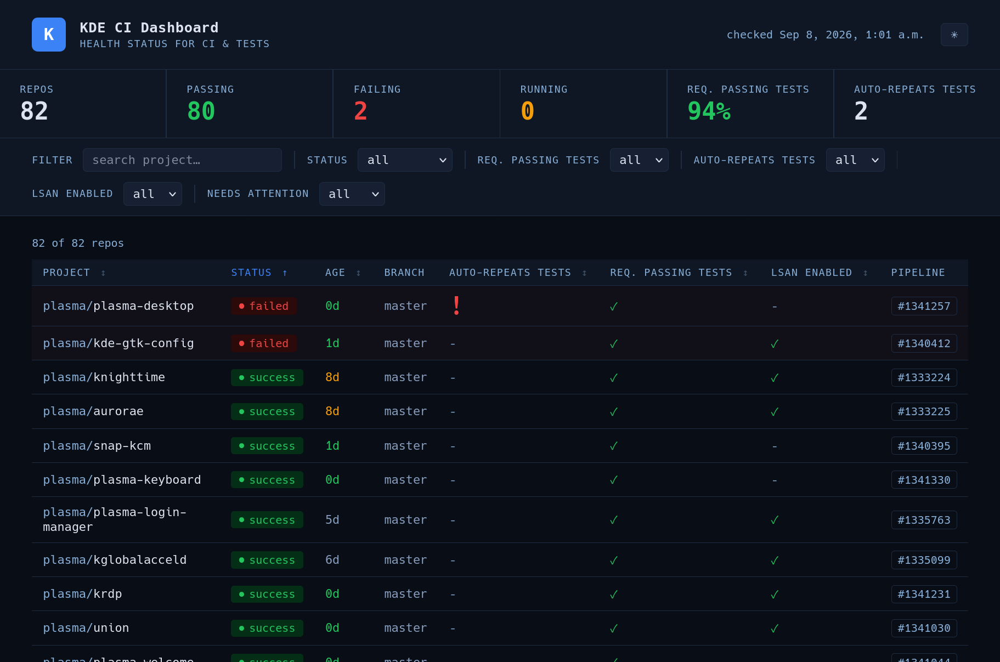

Its been a minute since my last posts when I went over plasma-keyboard and its
new diacritics feature, and the mega-sprint in Graz.

<!-- truncate -->

## Overview

I've been busy with a whole lot of things, but here's a brief highlight:

- Tons of bugfixes for plasma-keyboard and the diacritics feature after some
  distros set plasma-keyboard to be on by default. This unexpected new batch of
  testers found a host of bugs that warranted a bunch of frenetic bugfixing
  after the launch of Plasma 6.7; thankfully these were successful and the flow
  of bug reports slowed
- Improved the plasma-keyboard documentation for new contributors
- Added a bunch of unit tests for plasma-keyboard; a few months ago we had 0%
  test coverage and now we have 57% of C++ code covered by tests (would prefer
  it higher, but progress!)
- Added apidox to some difficult kwin code
- plasma-setup maintenance (we've had new contributors 🎉, bugs, proposals, etc)
- In relation to the STF grant to KDE, I've been doing technical review on
  behalf of the e.V. for all the changes being done (spoiler alert: a _massive_
  amount of amazing work has been/is being done!)
- A whole bunch of gardening, reviews, bug triage/fixing, etc — not so much of
  the fun stuff I would like such as the new plasma-keyboard features I have
  planned, but important work that has been needful
- Fixed the OSK (on-screen keyboard) button on the lock screen, and added a
  matching one to plasma-login-manager
- Hopefully being merged in time for 6.8: redesigned/fixed up system tray applet
  for plasma-keyboard


## ci-healthcheck

I created a utility to check the health of KDE CI along with a
[web dashboard](https://ci-healthcheck-5e5c80.local-kde.org/) to visualize the
results, and began making weekly updates on the state of all Plasma's CI health
on the mailing list.



In the beginning we regularly had a dozen or more repos with CI failing on
master, dozens of repos whose CI hadn't been run in months or in a few cases
_years_, and 14% of repos configured to report failing tests in the MR view.

Now we usually never have more than 1 or 2 repo with failing CI in master any
given week and even had a few weeks in a row with _no failing CI_, every Plasma
repo runs its CI against master at least once a week to catch issues, and fully
**94%** of Plasma repos are configured to report failing tests in the MR view.

I consider this a massive success! 🎉🎉🎉

Still more that can be done to improve the reports and CI health, but kudos to
everyone for helping trim the fat and keep our software stack healthy and
reliable! 🍪


## plasma-morekeys

There have been requests for plasma-keyboard to support
[full-sized keyboard layouts](https://invent.kde.org/plasma/plasma-keyboard/-/work_items/47),
however there has been debate about if that is appropriate to have in
plasma-keyboard; such a feature seems like it would be rather niche, while
adding a fair amount of complexity and maintenance burden.

Full-sized layouts wouldn't add any benefit for the vast majority of users who
want a way to type in a search, a text message, etc — it seems like a much rarer
user who would want to perform desktop keyboard shortcuts, use vim in a
terminal, change tty from their OSK instead of a real keyboard, etc.

The super talented Aleix created
[plasma-morekeys](https://invent.kde.org/apol/plasma-morekeys) as a solution for
those who want a full keyboard layout that simply emulates a real keyboard and
can do all of the above mentioned things like keyboard shortcuts, and more.


This is intended as a test; it was put together quickly so those who need this
feature can try it and provide feedback. If it proves successful then we can
transition it to an official project, perhaps provide integration with
plasma-keyboard to make choosing/using it seamless.

If you are one of the people with interest in a full-size keyboard layout for
your OSK, please give it a try:

- Install the plasma-morekeys flatpak (consider this alpha software!):
```
curl -L -o /tmp/plasma-morekeys.flatpak "https://nextcloud.merritt.codes/s/x4gqrs596NPYarF/download" && flatpak install --user --or-update --bundle /tmp/plasma-morekeys.flatpak
```
- Test out how it works for your usecases
- If you encounter bugs or find it isn't quite working how you require,
  [report it](https://invent.kde.org/apol/plasma-morekeys/-/work_items?sort=created_date&state=opened&first_page_size=100)
  and tell us what's wrong and what your usecase is so we can try and address it

## Akademy

Its just over a week until Akademy!! I'm looking forward to seeing a whole bunch
of my KDE family again in Graz, and the chance to get some important work done
together.

I have a bit of face blindness, so please don't be offended if I can't recognize
everyone on sight! (I often rely on other cues like mannerisms, hair style,
voice, etc)

I will try my best to be outgoing, but if I come across as a very anxious
wallflower please know that I am friendly and super happy to see you all, and I
appreciate the social butterflies pulling me into the mix! 😆

See you soon! 👋👋👋
